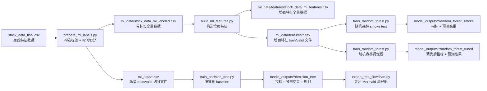

# 股票预测工程流程总览

## 1. 项目目标

本工程围绕多股票日频数据，搭建了一个从原始数据到机器学习建模的完整流程。当前主要覆盖两个预测场景：

1. 收盘后预测下一交易日收盘涨跌
2. 预测未来 5 个交易日收益率

当前工程重点已经完成到以下阶段：

- 原始数据整理
- EDA 与基础特征工程总结
- 标签构造与时间切分
- 增强特征生成
- 决策树 baseline
- 随机森林 smoke test
- 随机森林调优（去除市场级特征 + 超参数优化）
- 决策树可解释性导出

---

## 2. 当前工程主流程



---

## 3. 目录与文件职责

### 3.1 原始数据与报告

| 文件/目录 | 作用 |
|---|---|
| `stock_data_final.csv` | 当前建模主输入数据，包含 20 个基础特征 |
| `stock_data_final_scaled.csv` | 历史标准化版本，目前不参与当前建模流程 |
| `EDA_Report.md` | 早期 EDA 总结报告 |
| `Feature_Engineering_Final_Report.md` | 基础 20 特征工程总结报告 |
| `eda_plots/` | EDA 生成的图表文件 |

### 3.2 数据处理脚本

| 文件 | 作用 |
|---|---|
| `prepare_ml_labels.py` | 基于原始数据生成预测标签，并做无泄漏时间切分 |
| `build_ml_features.py` | 在已打标签数据上继续生成增强特征 |

### 3.3 建模与解释脚本

| 文件 | 作用 |
|---|---|
| `train_decision_tree.py` | 训练决策树 baseline，支持分类和回归两种场景 |
| `train_random_forest.py` | 训练随机森林，支持分类和回归两种场景 |
| `export_tree_flowchart.py` | 将训练好的决策树导出为 Mermaid 流程图 |

### 3.4 中间数据

| 目录/文件 | 作用 |
|---|---|
| `ml_data/stock_data_ml_labeled.csv` | 带标签的全量数据 |
| `ml_data/stock_data_next_day_train.csv` | 下一日场景训练集 |
| `ml_data/stock_data_next_day_valid.csv` | 下一日场景验证集 |
| `ml_data/stock_data_future_5d_train.csv` | 未来 5 日场景训练集 |
| `ml_data/stock_data_future_5d_valid.csv` | 未来 5 日场景验证集 |
| `ml_data/stock_data_split_summary.json` | 标签和切分摘要 |
| `ml_data/features/` | 增强特征版全量数据和 train/valid 文件 |

### 3.5 模型输出

| 目录 | 作用 |
|---|---|
| `model_outputs/next_day_decision_tree` | 下一日分类决策树输出 |
| `model_outputs/future_5d_decision_tree` | 未来 5 日回归决策树输出 |
| `model_outputs/next_day_random_forest_smoke` | 下一日随机森林 smoke test 输出 |
| `model_outputs/future_5d_random_forest_smoke` | 未来 5 日随机森林 smoke test 输出 |
| `model_outputs/next_day_random_forest_tuned` | 下一日随机森林调优版输出 |
| `model_outputs/future_5d_random_forest_tuned` | 未来 5 日随机森林调优版输出 |

---

## 4. 数据处理流程

### 4.1 原始建模数据

当前建模主数据文件：

- `stock_data_final.csv`

数据概况：

- 行数：`608,929`
- 列数：`22`
- 股票数：`505`
- 日期范围：`2013-03-11` 到 `2018-02-07`

当前数据字段包括：

- 基础价格成交量：`open, high, low, close, volume`
- 收益率与滞后：`return, log_return, return_lag_1, daily_return`
- 技术指标：`RSI_14, MACD, MACD_hist`
- 波动与位置：`BB_width, volatility_20, close_position, price_range`
- 趋势与动量：`close_to_SMA, price_momentum_20`
- 成交量指标：`volume_ratio, OBV_change`

### 4.2 标签构造

通过 `prepare_ml_labels.py`，工程中定义了两个预测目标：

#### 场景 A：收盘后预测下一日收盘涨跌/收益

- `target_return_1d = close(t+1) / close(t) - 1`
- `target_up_1d = 1[target_return_1d > 0]`

#### 场景 B：未来 5 日收益率

- `target_return_5d = close(t+5) / close(t) - 1`

### 4.3 时间切分

切分原则：

- 按时间切分，不随机打乱
- 验证集起点：`2017-02-14`
- 自动处理边界泄漏问题

切分结果：

#### 下一日场景

- 训练集：`483,867`
- 验证集：`124,057`
- 丢弃边界样本：`1,005`
- 训练最后可用特征日期：`2017-02-10`

#### 未来 5 日场景

- 训练集：`481,867`
- 验证集：`122,037`
- 丢弃边界样本：`5,025`
- 训练最后可用特征日期：`2017-02-06`

---

## 5. 增强特征工程

通过 `build_ml_features.py`，在基础 20 个特征上新增了 25 个增强特征，生成了 `54` 列的数据集。

### 5.1 新增特征类型

#### 多周期动量

- `momentum_3d`
- `momentum_5d`
- `momentum_10d`

#### 多周期波动

- `volatility_5`
- `volatility_10`

#### 均线与价格关系

- `close_to_sma_5`
- `close_to_sma_10`
- `sma_5_over_10`

#### 成交量变化

- `volume_ratio_5`
- `volume_trend_5`

#### 日内振幅与技术指标平滑

- `price_range_mean_5`
- `price_range_mean_10`
- `rsi_5_mean`
- `macd_hist_mean_3`
- `obv_change_mean_5`

#### 市场横截面代理特征

- `market_return_mean_1d`
- `market_volatility_mean_20`
- `market_up_ratio_1d`
- `relative_return_vs_market`
- `relative_momentum_vs_market`

#### 横截面排名特征

- `cs_rank_close_to_sma`
- `cs_rank_rsi_14`
- `cs_rank_volatility_20`
- `cs_rank_momentum_20`
- `cs_rank_volume_ratio`

### 5.2 特征文件输出

增强特征输出目录：

- `ml_data/features/`

主要文件：

- `stock_data_ml_features.csv`
- `stock_data_next_day_features_train.csv`
- `stock_data_next_day_features_valid.csv`
- `stock_data_future_5d_features_train.csv`
- `stock_data_future_5d_features_valid.csv`
- `ml_features_summary.json`

---

## 6. 建模流程

### 6.1 决策树 baseline

脚本：

- `train_decision_tree.py`

用途：

- 下一日场景：`DecisionTreeClassifier`
- 未来 5 日场景：`DecisionTreeRegressor`

默认特征：

- 使用 14 个较易解释的基础技术特征

输出内容：

- `metrics.json`
- `feature_importance.csv`
- `tree_rules.txt`
- `valid_predictions.csv`
- `model.pkl`

### 6.2 决策树可解释性导出

脚本：

- `export_tree_flowchart.py`

用途：

- 将 `model.pkl` 导出成 Mermaid 流程图

输出文件：

- `tree_flowchart.md`

### 6.3 随机森林 smoke test

脚本：

- `train_random_forest.py`

用途：

- 在增强特征数据上做更强一些的树模型测试
- 当前先做了 smoke test，主要验证工程链路和基础效果

额外输出：

- `daily_selection_metrics.csv`

这个文件按交易日统计 top/bottom 预测分组的真实表现，用于观察排序能力。

### 6.4 随机森林调优

脚本：

- `train_random_forest.py`（同一脚本，修改了默认参数）

调优策略：

基于 smoke test 的分析发现三个主要问题并逐一解决：

1. **降低树的复杂度**：`max_depth` 12→5，`min_samples_leaf` 50→300，减少过拟合
2. **增加树的数量**：`n_estimators` 40→300，让集体决策更稳定
3. **去除市场级特征**：移除 `market_return_mean_1d`、`market_volatility_mean_20`、`market_up_ratio_1d`（这三个变量在同一天对所有股票值相同，主导了特征重要性但不提供个股选择能力）
4. **调整特征采样**：`max_features` 从 `sqrt` 改为 `0.3`，每棵树看 30% 的特征

调优后的默认参数：

| 参数 | smoke 版 | 调优版 |
|---|---|---|
| `n_estimators` | 40 | 300 |
| `max_depth` | 12 | 5 |
| `min_samples_leaf` | 50 | 300 |
| `max_features` | sqrt | 0.3 |
| `max_samples` | 0.5 | 0.5 |
| 特征数量 | 39（含市场级） | 36（去除市场级） |

---

## 7. 已完成的实验结果

### 7.1 决策树：下一日涨跌分类

输出目录：

- `model_outputs/next_day_decision_tree`

验证结果：

- `accuracy = 0.5035`
- `precision = 0.5317`
- `recall = 0.4558`
- `roc_auc = 0.5081`

结论：

- 接近随机水平
- 说明“下一日涨跌”任务信号较弱
- 该模型更适合作为可解释 baseline，不适合作为最终模型

### 7.2 决策树：未来 5 日收益回归

输出目录：

- `model_outputs/future_5d_decision_tree`

验证结果：

- `mae = 0.0224`
- `rmse = 0.0324`
- `r2 = -0.0105`
- `directional_accuracy = 0.5315`

结论：

- 方向判断略高于随机
- 但精确回归能力较弱
- 仍以 baseline 和可解释为主

### 7.3 随机森林 smoke：下一日涨跌分类

输出目录：

- `model_outputs/next_day_random_forest_smoke`

验证结果：

- `accuracy = 0.4960`
- `precision = 0.5350`
- `recall = 0.3062`
- `roc_auc = 0.5091`
- `top_bottom_up_rate_spread = 0.0047`
- `oob_score = 0.6248`

结论：

- 当前参数下未明显优于决策树
- 工程链路已经打通
- 可继续做参数搜索或特征筛选

### 7.4 随机森林 smoke：未来 5 日收益回归

输出目录：

- `model_outputs/future_5d_random_forest_smoke`

验证结果：

- `mae = 0.0226`
- `rmse = 0.0325`
- `r2 = -0.0194`
- `directional_accuracy = 0.4777`
- `mean_daily_rank_ic = -0.0150`
- `top_bottom_return_spread = -0.00065`
- `oob_score = 0.0936`

结论：

- 当前 smoke 配置效果一般
- 还不能说明随机森林没价值，只能说明这版参数和特征组合未形成稳定优势

### 7.5 随机森林调优：下一日涨跌分类

输出目录：

- `model_outputs/next_day_random_forest_tuned`

验证结果：

- `accuracy = 0.5078`
- `precision = 0.5358`
- `recall = 0.4683`
- `roc_auc = 0.5100`
- `top_bottom_up_rate_spread = -0.0023`
- `oob_score = 0.5299`

与 smoke 版对比（括号内为变化）：

| 指标 | 决策树 | RF smoke | RF 调优 |
|---|---|---|---|
| accuracy | 0.5035 | 0.4960 | **0.5078**（+0.0118） |
| precision | 0.5317 | 0.5350 | **0.5358**（+0.0008） |
| recall | 0.4558 | 0.3062 | **0.4683**（+0.1621） |
| roc_auc | 0.5081 | 0.5091 | **0.5100**（+0.0009） |
| oob_score | — | 0.6248 | **0.5299**（-0.0949） |

结论：

- 所有核心指标均超过决策树 baseline
- recall 大幅恢复（0.306→0.468），模型不再过于保守
- OOB score 大幅下降并接近验证集表现，过拟合显著减轻
- 主要归功于降低树复杂度和去除市场级特征

### 7.6 随机森林调优：未来 5 日收益回归

输出目录：

- `model_outputs/future_5d_random_forest_tuned`

验证结果：

- `mae = 0.02239`
- `rmse = 0.03236`
- `r2 = -0.0079`
- `directional_accuracy = 0.5099`
- `mean_daily_rank_ic = -0.0161`
- `top_bottom_return_spread = -0.00127`
- `oob_score = 0.0168`

与 smoke 版对比：

| 指标 | 决策树 | RF smoke | RF 调优 |
|---|---|---|---|
| MAE | 0.02241 | 0.02262 | **0.02239**（-0.00023） |
| RMSE | 0.03239 | 0.03254 | **0.03236**（-0.00018） |
| R² | -0.0105 | -0.0194 | **-0.0079**（+0.0115） |
| 方向准确率 | 0.5315 | 0.4777 | **0.5099**（+0.0322） |
| oob_score | — | 0.0936 | **0.0168**（-0.0768） |

结论：

- MAE、RMSE、R² 均优于决策树和 smoke 版
- 方向准确率从 0.478 恢复到 0.510
- OOB score 与验证集 R² 的差距大幅缩小，过拟合显著改善
- 整体表明调优策略有效，但该任务信号本身仍然较弱

---

## 8. 工程中已经完成的工作清单

你当前这个工程，实际上已经做完了下面这些事：

1. 完成原始股票数据的 EDA 分析
2. 整理出 20 个基础特征的数据文件
3. 明确了两个机器学习预测场景
4. 构造了 `target_return_1d`、`target_up_1d`、`target_return_5d`
5. 做了严格按时间的 train/valid 切分
6. 处理了时间边界泄漏问题
7. 写好了标签生成脚本
8. 写好了增强特征脚本
9. 写好了决策树训练脚本
10. 写好了随机森林训练脚本
11. 跑通了两个场景的决策树 baseline
12. 导出了决策树规则文件
13. 导出了 Mermaid 决策树流程图
14. 跑通了两个场景的随机森林 smoke test
15. 生成了验证集逐条预测结果与分组评估文件
16. 分析 smoke test 不及决策树的原因（过拟合 + 市场级特征主导 + 超参数不合理）
17. 完成随机森林调优：降低树复杂度、增加树数量、去除市场级特征、调整特征采样
18. 调优后两个场景的随机森林均超过决策树 baseline

---

## 9. 当前推荐的复现顺序

如果以后重新整理环境，推荐按这个顺序运行：

```bash
python prepare_ml_labels.py
python build_ml_features.py
python train_decision_tree.py --scenario next_day
python train_decision_tree.py --scenario future_5d
python export_tree_flowchart.py --model-path model_outputs/next_day_decision_tree/model.pkl
python export_tree_flowchart.py --model-path model_outputs/future_5d_decision_tree/model.pkl
python train_random_forest.py --scenario next_day --output-dir model_outputs/next_day_random_forest_tuned
python train_random_forest.py --scenario future_5d --output-dir model_outputs/future_5d_random_forest_tuned
```

如果只是快速检查随机森林流程是否可用，可以运行 smoke test（使用较少的树和旧参数）：

```bash
python train_random_forest.py --scenario next_day --n-estimators 40 --max-depth 12 --min-samples-leaf 50 --max-features sqrt --output-dir model_outputs/next_day_random_forest_smoke
python train_random_forest.py --scenario future_5d --n-estimators 40 --max-depth 12 --min-samples-leaf 50 --max-features sqrt --output-dir model_outputs/future_5d_random_forest_smoke
```

---

## 10. 当前工程状态总结

当前工程已经不是“只有一份数据和几张图”的状态，而是一个可复现的小型机器学习 pipeline：

- 有原始数据
- 有特征工程
- 有标签构造
- 有时间切分
- 有增强特征
- 有 baseline 模型
- 有更强模型的测试脚本
- 有模型解释输出
- 有基于分析结论的模型调优记录

当前阶段最适合把它定位为：

**股票机器学习实验工程 v1.1**

它已经具备继续做以下工作的基础：

- 进一步参数搜索（如 GridSearch / Optuna）
- 特征筛选
- 增加新的模型（如 LightGBM / XGBoost）
- 增加回测/交易评估
- 补 README 和最终汇报文档

---

## 11. 建议后续补充

如果后面你继续迭代工程，建议再补这几类文档或脚本：

1. `README.md`
   用于面向别人快速介绍项目
2. `requirements.txt` 或 `environment.yml`
   固定环境依赖
3. `evaluate_predictions.py`
   统一做排序能力和收益分层评估
4. `train_hist_gradient_boosting.py` 或 `train_lightgbm.py`
   做比随机森林更强的树模型实验

---

## 12. 当前最关键的文件

如果只看最核心的工程文件，优先看这些：

- `stock_data_final.csv`
- `prepare_ml_labels.py`
- `build_ml_features.py`
- `train_decision_tree.py`
- `train_random_forest.py`
- `export_tree_flowchart.py`
- `ml_data/stock_data_split_summary.json`
- `ml_data/features/ml_features_summary.json`
- `model_outputs/next_day_decision_tree/metrics.json`
- `model_outputs/future_5d_decision_tree/metrics.json`
- `model_outputs/next_day_random_forest_tuned/metrics.json`
- `model_outputs/future_5d_random_forest_tuned/metrics.json`

---

这份文档的作用是帮助你以后快速回答三个问题：

1. 我的工程现在做到哪一步了？
2. 每个文件是干什么的？
3. 我以后从哪里继续往下做？
