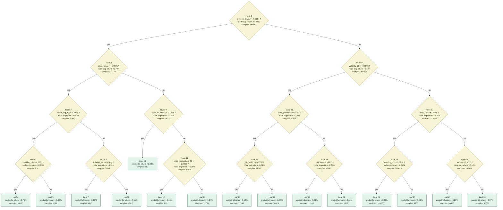

# Future 5D Decision Tree Flowchart



## Notes

- `yes` means the condition is true and the path goes left.
- `no` means the condition is false and the path goes right.
- `samples` is the number of training rows that reached that node.
- `predict 5d return` is the average target return for the training rows in that leaf.

## Summary

```json
{
  "model_file": "/Users/zhangximing/Desktop/eda_plots/model_outputs/future_5d_decision_tree/model.pkl",
  "model_type": "DecisionTreeRegressor",
  "max_depth": 4,
  "n_leaves": 15,
  "feature_names": [
    "return",
    "log_return",
    "close_to_SMA",
    "RSI_14",
    "MACD",
    "MACD_hist",
    "BB_width",
    "volatility_20",
    "price_momentum_20",
    "volume_ratio",
    "close_position",
    "return_lag_1",
    "daily_return",
    "price_range"
  ]
}
```
